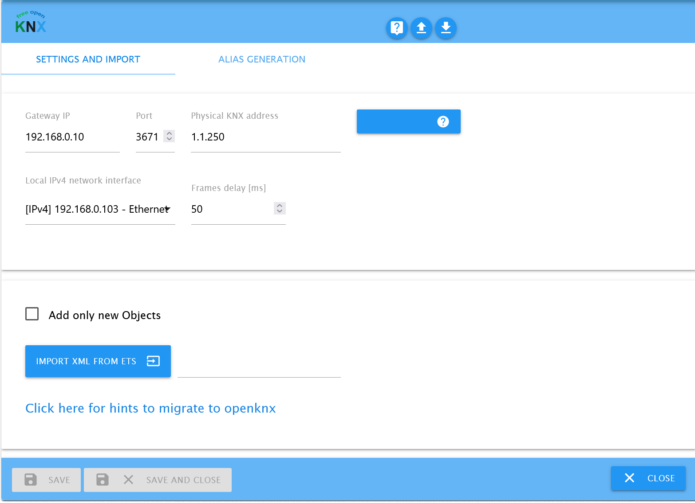
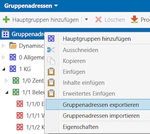

# ioBroker.openknx

## Installation

Der Adapter kann in der Adapterliste unter „openknx" gesucht und durch Klicken auf das +-Symbol installiert werden.

## Adapterkonfiguration



Drücken Sie „Speichern & Schließen" oder „Speichern", um den Adapter neu zu starten und die Änderungen zu übernehmen.
Beim Start versucht der Adapter alle Gruppenadressen zu lesen, die das Autoread-Flag gesetzt haben (Standardeinstellung).
Dies kann eine Weile dauern und eine höhere Last auf Ihrem KNX-Bus erzeugen. Dadurch ist sichergestellt, dass der Adapter von Beginn an mit aktuellen Werten arbeitet.
Autoread wird beim ersten Verbindungsaufbau mit dem KNX-Bus nach einem Adapter-Start oder -Neustart durchgeführt, nicht bei jeder KNX-Wiederverbindung.  
Nach der Adapterinstallation öffnen Sie die Adapterkonfiguration und füllen Sie folgende Felder aus:

### KNX Gateway IP

IP-Adresse Ihres KNX IP-Gateways.

### Port

Dies ist normalerweise Port 3671 des KNX IP-Gateways.

### Lokale IPv4-Netzwerkschnittstelle

Die Schnittstelle, die mit dem KNX IP-Gateway verbunden ist.

### Erkennen

Sucht über ein standardisiertes Protokoll alle verfügbaren KNX IP-Gateways auf der angegebenen Netzwerkschnittstelle.

### Minimale Sendeverzögerung zwischen zwei Frames [ms]

Diese Einstellung schützt den KNX-Bus vor Datenüberflutung, indem Datenframes auf eine bestimmte Rate begrenzt werden.
Nicht gesendete Frames werden verzögert, bis die Verzögerungszeit seit dem letzten Senden auf dem Bus abgelaufen ist. Wenn mehr Sendeanfragen warten, ist die Reihenfolge zufällig.
Wenn Sie in Ihrem Log Verbindungsabbrüche vom KNX IP-Gateway beobachten, erhöhen Sie diesen Wert.

### common.type boolean für 1-Bit-Enum anstelle von number verwenden

Verwendet im IOB-Objekt common.type boolean für 1-Bit-Enum anstelle von number.

### KNX-Werte beim Start von IOB-Objekten auslesen, die für Autoread konfiguriert sind

Alle IOB-Objekte, die mit dem Autoread-Flag konfiguriert sind, werden auf dem Bus angefordert, um mit IOB synchronisiert zu werden.

### Keine Warnung bei unbekannten KNX-Gruppenadressen

Es wird kein Warn-Logeintrag beim Empfang einer unbekannten GA erstellt.

### Vorhandene IOB-Objekte nicht überschreiben

Wenn aktiviert, überspringt der Import das Überschreiben vorhandener Kommunikationsobjekte.

### Vorhandene IOB-Objekte entfernen, die nicht in der ETS-Importdatei enthalten sind

Zum Bereinigen des Objektbaums.

### ETS-Projekt importieren und speichern

Der Dateidialog akzeptiert sowohl **.knxproj**- als auch **.xml**-Dateien. Der Adapter unterstützt zwei Importmethoden:

#### .knxproj-Import (empfohlen)

Importieren Sie die ETS-Projektdatei direkt. Dies ist die empfohlene Methode, da sie die vollständigsten Daten liefert:

1. Speichern Sie Ihr Projekt in ETS (Datei > Speichern). Die .knxproj-Datei befindet sich in Ihrem ETS-Projektverzeichnis.
2. Laden Sie die .knxproj-Datei im Adapter über den Importdialog hoch.
3. Wenn das Projekt passwortgeschützt ist, werden Sie aufgefordert, das Passwort einzugeben.
4. Der Import beginnt sofort und zeigt eine Fortschätzung basierend auf der Dateigröße an.

Vorteile gegenüber dem XML-Import:

- **Lesen/Schreiben/Übertragen/Aktualisieren-Flags** aus ComObjects (statt Standardwert read=true, write=true)
- **DPT-Ableitung** aus ComObjects, wenn der GA kein DPT zugewiesen ist
- **Raumzuweisung** aus der ETS-Gebäude-/Standortstruktur (erstellt enum.rooms automatisch)
- **Autoread-Flag** abgeleitet aus dem ComObject ReadOnInit-Flag
- Unterstützt ETS4-, ETS5- und ETS6-Projekte (einschließlich passwortgeschützter Projekte)
- Zukünftige ETS-Versionen funktionieren automatisch – kein Adapter-Update für neue ETS-Patch-/Minor-Releases erforderlich

Nach einem erfolgreichen .knxproj-Import verwenden Sie die Funktion „Aliases erstellen" unten, um Status-GAs mit ihren entsprechenden Aktions-GAs zu verknüpfen.

#### XML-Import (Fallback)



1. Gehen Sie in ETS zu Gruppenadressen, wählen Sie „Gruppenadresse exportieren" und wählen Sie den XML-Export im neuesten Formatversionsformat.
   ETS4-Format wird nicht unterstützt, da es keine DPT-Informationen enthält.
2. Laden Sie Ihren ETS Export XML im Adapter über den Importdialog hoch.
3. Der Import beginnt sofort nach der Dateiauswahl und gibt nach Abschluss einen Statusbericht aus.
   Nach dem erfolgreichen Import zeigt eine Meldung an, wie viele Objekte erkannt wurden.
   Ein Fehlerdialog zeigt Probleme beim Import und gibt Hinweise zur Bereinigung der ETS-Datenbank.
   Weitere Informationen finden Sie im Log.
   Die Daten werden gespeichert und der Adapter wird zurückgesetzt.

Hinweis zur ETS-Konfiguration:
Wenn Sie für die GA und in den Kommunikationsobjekten, die diese GA verwenden, unterschiedliche DPT-Subtypen haben, scheint ETS den DPT-Typ mit der niedrigsten Nummer zu verwenden.
Stellen Sie in diesem Fall manuell sicher, dass alle Elemente denselben gewünschten Datentyp verwenden.
Eine GA ohne DPT-Basistyp kann mit diesem Adapter nicht importiert werden. ETS4-Projekte müssen in ETS5 oder höher konvertiert werden und der DPT muss der GA zugewiesen sein.

### Gruppenadressenstil

Der Stil definiert nur die Darstellung der Gruppenadresse in der ETS-Benutzeroberfläche. Folgende Stile sind verfügbar:

|     | Darstellungsstil | Name                       | Beispiel |
| --- | ---------------- | -------------------------- | -------- |
| 1   | 3-stufig         | Hauptgruppe/Mittelgruppe/Untergruppe | 1/3/5  |
| 2   | 2-stufig         | Hauptgruppe/Untergruppe    | 1/25     |
| 3   | Freie Stufe      | Untergruppe                | 300      |

Der Adapter unterstützt alle 3 Stilkonfigurationen in der Projektimport-XML-Datei. Beim Speichern im IOB-Objekt wird das Format immer in die 3-stufige Form umgewandelt.
Bitte beachten Sie, dass die kombinierte GA und der Gruppenname im IOB-Objektbaum eindeutig sein müssen. Eine ETS-Konfiguration mit zwei Mittelgruppen desselben Namens führt zu einem gemeinsamen Hierarchieelement, und zwei identisch benannte GAs darin führen zu einem Fehler.

### Alias

KNX-Geräte können GAs für Statusrückmeldungen haben, die zu einer Steuerungs-GA gehören. Einige Anwendungen wie bestimmte VIS-Widgets erwarten ein kombiniertes Status- und Betätigungsobjekt. Sie können diese separaten Objekte zu einem sogenannten Alias kombinieren. Das Menü hilft dabei, passende Paare gemäß der Namenskonvention mit der angegebenen Filterregel zu erstellen.
Weitere Informationen finden Sie hier: https://www.iobroker.net/#en/documentation/dev/aliases.md

### Regulärer Ausdruck

Filterregel für das Statusobjekt. Wird verwendet, um passende Schreib- und Lese-GA-Paare zu finden.

### Mindestähnlichkeit

Definiert, wie streng der Übereinstimmungsalgorithmus ähnliche Einträge herausfiltert.

### Alias-Pfad

Der Objektordner, in dem die Aliasse generiert werden.

### Gruppenbereich in Suche einschließen

Der gesamte Name einschließlich Pfad wird zur Ähnlichkeitsprüfung verwendet.

## Hinweise zur Adaptermigration

### Node Red migrieren

-   Im rechten Seitenmenü „Export" auswählen
-   „Alle Flows", „Herunterladen" auswählen
-   Im Texteditor knx.0. durch openknx.0. ersetzen
-   Rechtes Seitenmenü, „Import" auswählen
-   Geänderte Datei auswählen
-   Im Dialog „Flows" auswählen (Subflows, Konfigurationsknoten nur wenn betroffen) → neue Tabs werden hinzugefügt
-   Alte Flows manuell löschen

### VIS migrieren

-   VIS-Editor öffnen
-   Setup → Projekt-Export/Import → Normal exportieren
-   ZIP-Datei und vis-views.json in einem Editor öffnen
-   knx.0. durch openknx.0. suchen und ersetzen
-   vis-views.json und vis-user.css in eine ZIP-Datei komprimieren
-   Setup → Projekt-Export/Import → Import
-   ZIP-Datei in den Drop-Bereich verschieben
-   Projektname = main
-   Projekt importieren

### Skripte migrieren

-   Skripte öffnen
-   3 Punkte → Alle Skripte exportieren
-   ZIP-Datei öffnen und den Ordner in einem Editor öffnen
-   knx.0 durch openknx.0 suchen und ersetzen
-   Alle geänderten Dateien in eine ZIP-Datei komprimieren
-   3 Punkte → Skripte importieren
-   ZIP-Datei in den Drop-Bereich verschieben

### Grafana migrieren

-   Alle Dashboards durchgehen und „Teilen" → „Exportieren" → „In Datei speichern" auswählen
-   Im Texteditor knx.0. durch openknx.0. ersetzen
-   Um ein Dashboard zu importieren, klicken Sie auf das +-Symbol im Seitenmenü und dann auf „Import"
-   Hier können Sie eine Dashboard-JSON-Datei hochladen
-   „Import (Überschreiben)" auswählen

### Influx migrieren

-   Über SSH bei Ihrem IOBroker anmelden und den Befehl influx ausführen
-   iobroker verwenden (oder Ihre spezifische Datenbank, die mit dem Befehl show databases aufgelistet wird)
-   Einträge auflisten mit: show measurements
-   Tabellen mit folgendem Befehl kopieren: select \* into "entry_new" from "entry_old";
    wobei entry_old auf den alten Adapterobjektpfad zeigt und entry_new auf die openknx-Adapterinstanz
-   Influx für neuen Objekteintrag entry_new aktivieren

## Verwendung des Adapters & grundlegende Konzepte

### ACK-Flags bei Tunneling-Verbindungen

Anwendungen sollen das ACK-Flag nicht setzen; die Anwendung wird von diesem Adapter durch das ACK-Flag benachrichtigt, wenn Daten aktualisiert werden.
OpenKNX setzt das ACK-Flag des entsprechenden IoBroker-Objekts beim Empfang einer Gruppenadresse, wenn ein anderer KNX-Host auf den Bus schreibt.

| GA ist                                   | mit Gerät mit R-Flag verbunden    | mit Gerät ohne R-Flag verbunden   | nicht verbunden              |
| ---------------------------------------- | --------------------------------- | --------------------------------- | ---------------------------- |
| Anwendung sendet GroupValue_Write        | OpenKNX generiert ACK             | OpenKNX generiert ACK             | OpenKNX generiert kein ACK   |
| Anwendung sendet GroupValue_Read         | OpenKNX generiert ACK             | OpenKNX generiert kein ACK        | OpenKNX generiert kein ACK   |

### Node Red – Beispiel für komplexen Datentyp

Erstellen Sie einen Funktionsknoten, der mit einem ioBroker-Out-Knoten verbunden ist, der sich mit einem KNX-Objekt vom Typ DPT-2 verbindet.
msg.payload = {"priority":1 ,"data":0};
return msg;

## Log-Level

Aktivieren Sie den Expertenmodus, um zwischen verschiedenen Log-Leveln umschalten zu können. Der Standard-Log-Level ist „info".  


## Beschreibung des IOBroker-Kommunikationsobjekts

IoBroker definiert Objekte zur Verwaltung von Kommunikationsschnittstelleneinstellungen.  
Der GA-Import erzeugt eine Kommunikationsobjekt-Ordnerstruktur entsprechend dem GA-Hauptgruppen-/Mittelgruppen-Schema. Jede Gruppenadresse ist ein Objekt mit den folgenden automatisch generierten Daten.

IoBroker State-Rollen (https://github.com/ioBroker/ioBroker/blob/master/doc/STATE_ROLES.md) haben standardmäßig den Wert „state". Einige spezifischere Werte werden vom DPT abgeleitet, z. B. Date oder Switch.

Autoread wird auf false gesetzt, wenn aus dem DPT ersichtlich ist, dass es sich um ein Triggersignal handelt. Dies gilt für Szenennummern.

```json
{
    "_id": "pfad.und.name.zum.objekt", // abgeleitet aus der KNX-Struktur
    "type": "state",
    "common": {
        // Werte hier können von iobroker interpretiert werden
        "desc": "Basistyp: 1-Bit-Wert, Subtyp: Schalter", // informativ, aus DPT
        "name": "Aussen Melder Licht schalten", // informativer Beschreibungsname aus dem ETS-Export
        "read": true, // Standard gesetzt; wenn false, werden eingehende Buswerte das Objekt nicht aktualisieren
        "role": "state", // Standard state, abgeleitet vom DPT
        "type": "boolean", // boolean, number, string, object, abgeleitet vom DPT
        "unit": "", // abgeleitet vom DPT
        "write": true // Standard true; wenn gesetzt, löst eine Änderung am Objekt einen KNX-Schreibvorgang aus; ein erfolgreicher Schreibvorgang setzt dann das ACK-Flag auf true
    },
    "native": {
        // Werte hier können vom openknx-Adapter interpretiert werden
        "address": "0/1/2", // KNX-Gruppenadresse
        "answer_groupValueResponse": false, // Standard false; wenn auf true gesetzt, antwortet der Adapter auf GroupValue_Read mit dem Wert
        "autoread": true, // Standard true für Nicht-Triggersignale; der Adapter sendet beim Start ein GroupValue_Read zur Synchronisierung
        "bitlength": 1, // Größe der KNX-Daten, abgeleitet vom DPT
        "dpt": "DPT1.001", // DPT
        "encoding": {
            // Werte der Schnittstelle, wenn es ein Enum-DPT-Typ ist
            "0": "Aus",
            "1": "An"
        },
        "force_encoding": "", // informativ
        "signedness": "", // informativ
        "valuetype": "basic" // composite bedeutet Setzen über ein bestimmtes JavaScript-Objekt
    },
    "from": "system.adapter.openknx.0",
    "user": "system.user.admin",
    "ts": 1638913951639
}
```

## Beschreibung der Adapter-Kommunikationsschnittstelle

Unterstützte DPTs: 1-21, 232, 237, 238  
Nicht unterstützte DPTs werden als rohe Puffer geschrieben; die Schnittstelle ist eine aufeinanderfolgende Zeichenkette aus Hexadezimalzahlen. Schreiben Sie beispielsweise „0102feff", um die Werte 0x01 0x02 0xfe 0xff auf den Bus zu senden.
Wenn der Datentyp „number" verwendet wird, beachten Sie bitte, dass Schnittstellenwerte skaliert sein können.

### API-Aufruf

IoBroker definiert States als Kommunikationsschnittstelle.

```javascript
setState(
    '',                                             // @param {string}                                ID des Objekts mit Pfad
    {                                               // @param {object|string|number|boolean}          state: einfacher Wert oder Objekt mit Attributen
	val:    value,
	ack:    true|false,                         // optional, sollte laut Konvention false sein
	ts:     timestampMS,                        // optional, Standard – jetzt
	q:      qualityAsNumber,                    // optional, auf Wert 0x10 setzen, um ein Bus-GroupValue_Read auszulösen (angegebener StateValue wird ignoriert)
	from:   origin,                             // optional, Standard – dieser Adapter
	c:      comment,                            // optional, auf Wert GroupValue_Read setzen, um ein Bus-GroupValue_Read auszulösen (angegebener StateValue wird ignoriert)
	expire: expireInSeconds                     // optional, Standard – 0
	lc:     timestampMS                         // optional, Standard – berechneter Wert
    },
    false,                                          // @param {boolean} [ack]                         optional, sollte laut Konvention false sein
    {},                                             // @param {object} [options]                      optional, Benutzerkontext
    (err, id) => {}                                 // @param {ioBroker.SetStateCallback} [callback]  optional, gibt Fehler und ID zurück
);
```

Beispiel zum Auslösen eines GroupValue_Read:

```javascript
setState(myState, { val: false, ack: false, c: "GroupValue_Read" });
setState(myState, { val: false, ack: false, q: 0x10 });
```

Der GroupValue_Read-Kommentar funktioniert nicht für den JavaScript-Adapter. Verwenden Sie stattdessen den qualityAsNumber-Wert 0x10.

### Beschreibung aller DPTs

| KNX DPT   | JavaScript-Datentyp    | Sonderwerte                                                                                          | Wertebereich                              | Hinweis                                                |
| --------- | ---------------------- | ---------------------------------------------------------------------------------------------------- | ----------------------------------------- | ------------------------------------------------------ |
| DPT-1     | number enum            |                                                                                                      | 1 Bit false, true                         |                                                        |
| DPT-2     | object                 | {"priority":1 Bit,"data":1 Bit}                                                                      | -                                         |                                                        |
| DPT-3     | object                 | {"decr_incr":1 Bit,"data":2 Bit}                                                                     | -                                         |                                                        |
| DPT-18    | object                 | {"save_recall":0,"scenenumber":0}                                                                    | -                                         | Datenpunkttyp DPT_SceneControl aus Autoread entfernt   |
|           |                        |                                                                                                      |                                           | save_recall: 0 = Szene aufrufen, 1 = Szene speichern  |
| DPT-21    | object                 | {"outofservice":0,"fault":0,"overridden":0,"inalarm":0,"alarmunack":0}                               | -                                         |                                                        |
| DPT-232   | object                 | {red:0..255, green:0.255, blue:0.255}                                                                | -                                         |                                                        |
| DPT-237   | object                 | {"address":0,"addresstype":0,"readresponse":0,"lampfailure":0,"ballastfailure":0,"convertorerror":0} | -                                         |                                                        |
| DPT-4     | string                 |                                                                                                      | ein Zeichen als 8-Bit-Zeichen gesendet    |                                                        |
| DPT-16    | string                 |                                                                                                      | ein Zeichen als 16-Zeichen-String gesendet |                                                       |
| DPT-5     | number                 |                                                                                                      | 8-Bit vorzeichenloser Wert                |                                                        |
| DPT-5.001 | number                 |                                                                                                      | 0..100 [%] skaliert auf 1 Byte            |                                                        |
| DPT-5.003 | number                 |                                                                                                      | 0..360 [°] skaliert auf 1 Byte            |                                                        |
| DPT-6     | number                 |                                                                                                      | 8-Bit vorzeichenbehaftet -128..127        |                                                        |
| DPT-7     | number                 |                                                                                                      | 16-Bit vorzeichenloser Wert               |                                                        |
| DPT-8     | number                 |                                                                                                      | 2-Byte vorzeichenbehafteter Wert -32768..32767 |                                                   |
| DPT-9     | number                 |                                                                                                      | 2-Byte-Gleitkommazahl                     |                                                        |
| DPT-14    | number                 |                                                                                                      | 4-Byte-Gleitkommazahl                     |                                                        |
| DPT-12    | number                 |                                                                                                      | 4-Byte vorzeichenloser Wert               |                                                        |
| DPT-13    | number                 |                                                                                                      | 4-Byte vorzeichenbehafteter Wert          |                                                        |
| DPT-15    | number                 |                                                                                                      | 4 Byte                                    |                                                        |
| DPT-17    | number                 |                                                                                                      | 1 Byte                                    | DPT_SceneNumber wird nicht durch Autoread gelesen      |
| DPT-20    | number                 |                                                                                                      | 1 Byte                                    |                                                        |
| DPT-238   | number                 |                                                                                                      | 1 Byte                                    |                                                        |
| DPT-10    | number für Date-Objekt |                                                                                                      | -                                         |                                                        |
| DPT-11    | number für Date-Objekt |                                                                                                      | -                                         |                                                        |
| DPT-19    | number für Date-Objekt |                                                                                                      | -                                         |                                                        |
| DPT-26    | string                 | z. B. 00010203..                                                                                     | -                                         | Datenpunkttyp DPT_SceneInfo wird nicht durch Autoread gelesen |
| DPT-28    | string                 |                                                                                                      | variabel                                  | Unicode UTF-8 kodierter String                         |
| DPT-29    | string                 | z. B. „123456789000"                                                                                 | 8-Byte vorzeichenbehafteter Wert          | Der Datentyp in IOB dieses numerischen Werts ist string |
| DPT-238   | string                 | z. B. 00010203..                                                                                     | -                                         | DPT_SceneConfig wird nicht durch Autoread gelesen      |
| Rest      | string                 | z. B. 00010203..                                                                                     | -                                         |                                                        |

Mit zeitbasierten KNX-Datentypen werden nur Zeit- und Datumsinformationen ausgetauscht, z. B. hat DPT-19 nicht unterstützte Felder für die Signalqualität.

Objekt-Sende- und Empfangswerte sind vom Typ boolean (DPT-1), number (skaliert oder unskaliert) oder string.  
DPT-2 erwartet ein Objekt {"priority":0,"data":1}; der Empfang liefert ein stringifiziertes Objekt desselben Typs.  
Andere verbundene DPTs haben eine ähnliche Objektnotation.  
DPT-19 erwartet eine Zahl von einem Date-Objekt. IoBroker kann keine Objekte verarbeiten; Felder des KNX-KO, die nicht aus einem Zeitstempel abgeleitet werden können, sind nicht implementiert, z. B. Qualitäts-Flags.

Datums- und Zeit-DPTs (DPT10, DPT11)  
Bitte beachten Sie, dass JavaScript und KNX sehr unterschiedliche Basistypen für Zeit und Datum haben.
DPT10 ist Zeit (hh:mm:ss) plus „Wochentag". Dieses Konzept ist in JS nicht verfügbar, daher erhalten/setzen Sie ein reguläres JS-Date-Objekt, müssen aber bedenken, dass Sie Datum, Monat und Jahr ignorieren müssen. Das exakt gleiche Datagramm, das zu „Mo, 1. Jul. 12:34:56" konvertiert, wird eine Woche später zu einem völlig anderen JS-Datum „Mo, 8. Jul. 12:34:56" ausgewertet. Seien Sie gewarnt!
DPT11 ist Datum (TT/MM/JJJJ): Dasselbe gilt für DPT-11, Sie müssen den Zeitteil ignorieren.

(KNX-Spezifikation der DPTs: https://www.knx.org/wAssets/docs/downloads/Certification/Interworking-Datapoint-types/03_07_02-Datapoint-Types-v02.02.01-AS.pdf)

### GroupValue_Write

Das Senden einer GroupValue_Write-Nachricht wird durch das Schreiben eines Kommunikationsobjekts ausgelöst.
Das Kommunikationsobjekt wird ausgelöst, wenn ein Schreib-Frame auf dem Bus empfangen wird.

### GroupValue_Read

Das Senden eines GroupValue_Read kann durch das Schreiben eines Kommunikationsobjekts mit Kommentar ausgelöst werden. Weitere Details finden Sie im Abschnitt „API-Aufruf".
Beim Empfang wird, wenn konfiguriert, eine GroupValue_Response (Einschränkung: derzeit GroupValue_Write) des aktuellen Kommunikationsobjektwerts ausgelöst (siehe unten).

### GroupValue_Response

Wenn answer_groupValueResponse auf true gesetzt ist, antwortet der Adapter mit einer GroupValue_Response auf eine zuvor empfangene GroupValue_Read-Anfrage.
Dies ist das KNX-Lese-Flag. Nur ein Kommunikationsobjekt auf dem Bus oder das IOBroker-Objekt sollte dieses Flag gesetzt haben, idealerweise dasjenige, das den Zustand am besten kennt.

### Zuordnung zu KNX-Flags

Die KNX-Objekt-Flags definieren das Busverhalten des Objekts, das sie repräsentieren.
Es sind 6 verschiedene Objekt-Flags definiert.

Beim .knxproj-Import werden die Flags direkt aus den ETS-ComObjects gelesen. Beim XML-Import werden sinnvolle Standardwerte angewendet.

| Flag                          | Flag de                    | Adapterverwendung (.knxproj)           | Adapterverwendung (XML-Import)         |
| ----------------------------- | -------------------------- | -------------------------------------- | -------------------------------------- |
| C: Kommunikations-Flag        | K: Kommunikations-Flag     | immer gesetzt                          | immer gesetzt                          |
| R: Lese-Flag                  | L: Lese-Flag               | object common.read                     | Standard true                          |
| T: Übertragungs-Flag          | Ü: Übertragen-Flag         | object common.update                   | Standard false                         |
| W: Schreib-Flag               | S: Schreiben-Flag          | object common.write                    | Standard true                          |
| U: Aktualisierungs-Flag       | A: Aktualisieren-Flag      | object native.update                   | Standard false                         |
| I: Initialisierungs-Flag      | I: Initialisierungs-Flag   | object native.autoread                 | abgeleitet vom DPT                     |

Hinweis: `native.answer_groupValueResponse` muss bei Bedarf weiterhin manuell gesetzt werden.

## Überwachung und Fehlerverfolgung

Openknx verwendet sentry.io für Anwendungsüberwachung und Fehlerverfolgung.
Es hilft Entwicklern, Fehler besser aufzuspüren und Nutzungsdaten aus der Praxis zu gewinnen. Die Identifikation eines Nutzers wird pseudonymisiert verfolgt.
Die Daten werden an den in Deutschland gehosteten IoBroker-Sentry-Server gesendet. Wenn Sie der ioBroker GmbH erlaubt haben, Diagnosedaten zu sammeln, wird auch Ihre anonyme Installations-ID einbezogen. Dies ermöglicht Sentry, Fehler zu gruppieren und anzuzeigen, wie viele eindeutige Nutzer von einem solchen Fehler betroffen sind.

Openknx schätzt die aktuelle Buslast der verbundenen KNX-Linie im Objekt `info.busload`.

## Funktionen

- Nativer .knxproj-Import (ETS4, ETS5, ETS6) mit Passwortunterstützung
- Lesen/Schreiben/Übertragen/Aktualisieren-Flags aus ETS-ComObjects
- DPT-Ableitung aus ComObjects, wenn der GA-Level-DPT fehlt
- Raumzuweisung (enum.rooms) aus der ETS-Gebäudestruktur
- XML-Gruppenadressenimport als Fallback
- KNX Secure (IP Secure Tunneling über .knxkeys-Schlüsseldatei oder Passwort)
- Stabiler und zuverlässiger KNX-Stack auf Basis von KNXUltimate
- Automatische Kodierung/Dekodierung von KNX-Datagrammen für die meisten DPTs, Raw-Lesen und -Schreiben für andere DPTs
- Unterstützung von KNX GroupValue_Read, GroupValue_Write und GroupValue_Response
- Freie Open-Source-Software, keine Cloud-Abhängigkeiten, funktioniert offline
- Autoread beim Start
- Erstellen von gemeinsamen Alias-Objekten, die auf Statusinputs reagieren
- Unterstützung aller Gruppenadressenstile (3-stufig, 2-stufig, frei)

## Einschränkungen

- Nur IPv4 wird unterstützt

## Häufig gestellte Fragen (FAQ)

**Autoread löst Aktoren auf dem Bus aus**

Prüfen Sie in ETS, ob Gruppenobjekte bestimmter Geräte, die mit der verdächtigen GA verbunden sind, das R/L-Flag konfiguriert haben. Dies sollte nicht der Fall sein, wenn das Gerät ein Verbraucher des Signals ist. Wenn das Signal einen Ereignischarakter hat, würde ein groupValueRead dieses Ereignis auslösen. Ändern Sie die Konfiguration in ETS oder deaktivieren Sie Autoread für dieses Objekt.

**DISCONNECT_REQUEST beim Start**

Erhöhen Sie die Einstellung für die minimale Sendeverzögerung zwischen zwei Frames, um eine Überlastung der Schnittstelle zu vermeiden.

**Wird Secure Tunneling unterstützt?**

Ja. KNX IP Secure Tunneling wird über eine .knxkeys-Schlüsseldatei oder ein Passwort unterstützt.
