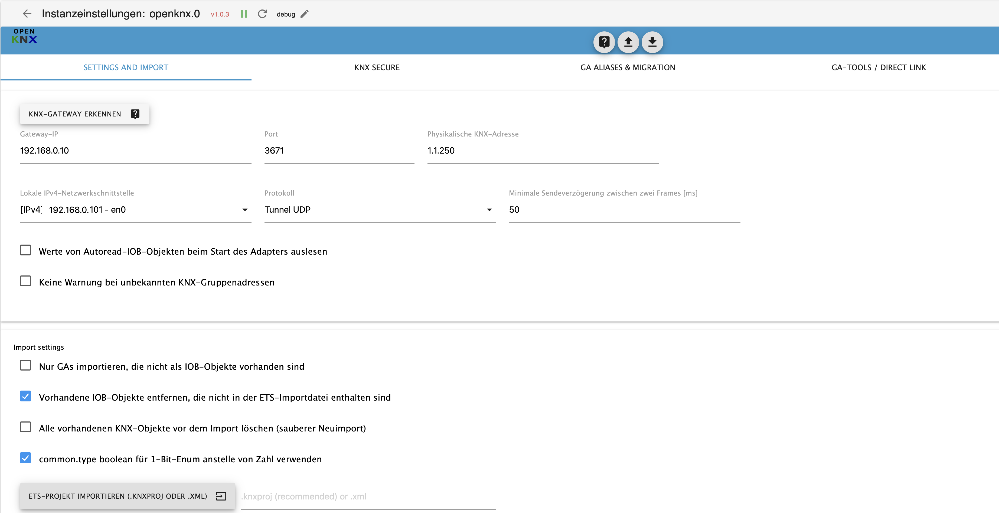
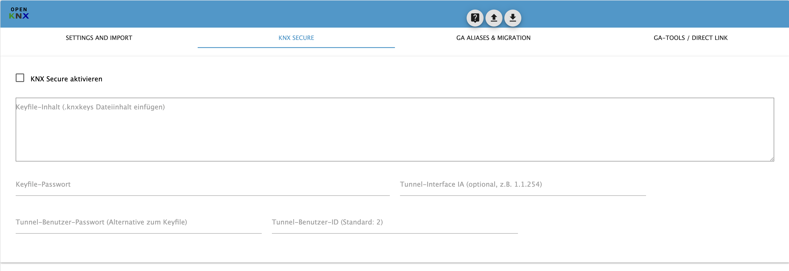
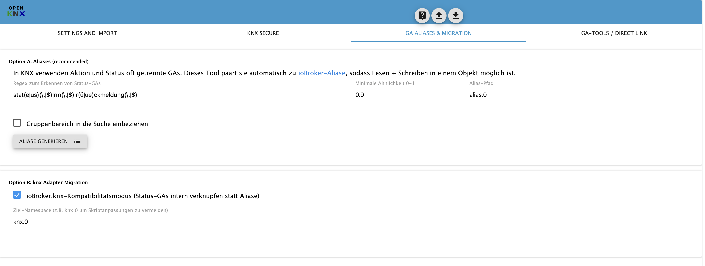
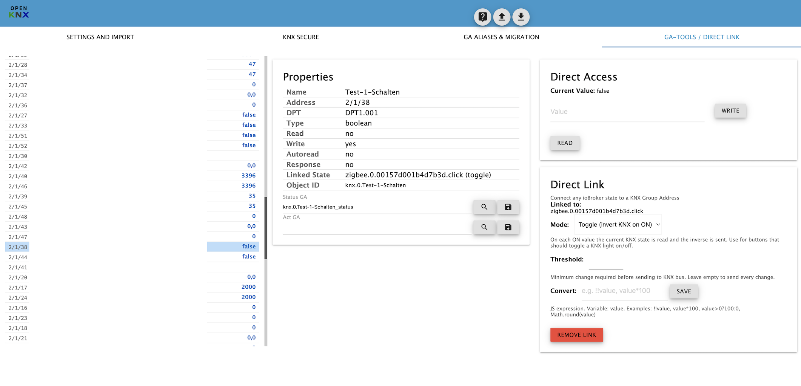
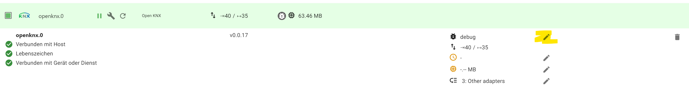

# ioBroker.openknx

## Features

- Native .knxproj import (ETS4, ETS5, ETS6) with password support
- Read/Write/Transmit/Update flags from ETS ComObjects
- DPT inference from ComObjects when GA-level DPT is missing
- Room assignment (enum.rooms) from ETS building structure
- XML group address import as fallback
- KNX IP Secure tunneling via .knxkeys keyfile or password
- Stable and reliable KNX stack powered by KNXUltimate
- Automatic encoding/decoding of KNX datagrams for most DPTs, raw read and write for others
- GroupValue Read, Write, and Response support
- Alias generation to merge action and status GAs into a single ioBroker object
- Direct Link: connect any ioBroker state to a KNX group address
- Supports all group address styles (3-level, 2-level, free)
- Free open source, no cloud dependencies, runs offline

## Installation

Search for "openknx" in the adapter list and install by clicking the + symbol.

## Adapter configuration



Press "save & close" or "save" to restart the adapter and apply the changes.

- **Detect** -- scans the network for all available KNX IP gateways. Best to select the local network interface first, then run detection -- gateway IP, port, and physical address are filled in automatically.
- **Local IPv4 network interface** -- the network interface of the ioBroker server that can reach the KNX IP gateway. Select before running detection.
- **KNX Gateway IP** -- IP address of your KNX IP gateway. Filled in automatically by detection.
- **Port** -- normally 3671. Filled in automatically by detection.
- **Protocol** -- connection type to the KNX IP gateway. **UDP tunneling** is the default for most KNX IP interfaces and routers (e.g. Weinzierl, MDT, ABB). **TCP tunneling** provides a more reliable connection and is supported by newer gateways -- recommended when available. **Multicast routing** connects via KNXnet/IP routing (multicast group 224.0.23.12) and is meant for KNX IP routers acting as line couplers -- no tunneling connection is established and multiple clients can access simultaneously.
- **Physical KNX address** -- the individual address the adapter uses on the KNX bus (e.g. 1.1.250). Must be configured as an additional address in the IP interface in ETS and must not be used by another device.
- **Minimum send delay between two frames [ms]** -- protects the KNX bus from flooding by too-fast telegrams. Increase this value if you see DISCONNECT_REQUEST errors in the log (e.g. to 80-150ms).
- **use common.type boolean for 1 bit enum instead of number** -- DPT-1 (switching) is represented as boolean type (true/false) in ioBroker instead of number (0/1). Enable for better compatibility with VIS widgets and scripts that expect boolean.
- **readout KNX values on startup** -- all objects with the autoread flag are read from the KNX bus on first connection after adapter start, to synchronize current states.
- **do not warn on unknown KNX group addresses** -- suppress warning log entries when receiving telegrams for GAs not configured in the adapter. Useful in installations with many GAs where only a subset is used in the adapter.
- **Group Address Style** -- defines the GA presentation matching your ETS configuration. All 3 styles are supported and converted to 3-level format for storage: 3-Level (1/3/5), 2-Level (1/25), or Free (300). The combined GA and group name must be unique in the ioBroker object tree.

### Import ETS project (.knxproj or .xml)

The import dialog accepts both **.knxproj** (recommended) and **.xml** files.

#### .knxproj import (recommended)

Import the ETS project file directly. This provides the most complete data:

1. In ETS, save your project (File > Save). The .knxproj file is located in your ETS project directory.
2. If the project is password-protected, enter the project password in the password field next to the import button.
3. Upload the .knxproj file in the adapter via the import dialog.
4. Import starts immediately and shows a progress estimate based on file size.

Advantages over XML import:

- **Read/Write/Transmit/Update flags** from ComObjects (instead of defaulting to read=true, write=true)
- **DPT inference** from ComObjects when no DPT is assigned to the GA
- **Room assignment** from ETS building/location structure (creates enum.rooms automatically)
- **Autoread flag** derived from the ComObject ReadOnInit flag
- Supports ETS4, ETS5, and ETS6 projects (including password-protected ones)
- Future ETS versions work automatically -- no adapter update needed for new ETS patch/minor releases

After a successful .knxproj import, use the "Create Aliases" function below to link status GAs with their corresponding action GAs.

#### XML import (fallback)

If you cannot use .knxproj, you can export Group Addresses from ETS as XML:


1. In ETS go to Group Addresses, select export group address and select XML export in latest format version.
   ETS4 Format is not supported, it does not contain DPT information.
2. Upload your ETS Export XML in the adapter via the import dialog.
3. Import starts immediately and gives a status report after completion.

Hint: If you have different DPT Subtypes for a GA and the communication objects using it, ETS uses the lowest DPT number. Ensure all elements use the desired datatype. A GA without DPT basetype cannot be imported. ETS4 projects must be converted to ETS5 or later with DPT set on the GA.

#### Import options

- **do not overwrite existing IOB objects** -- skip existing communication objects during import, only add new ones.
- **remove existing IOB objects not in ETS import file** -- delete objects from the ioBroker tree that no longer exist in the ETS project. Useful to clean up after removing GAs in ETS.
- **delete all existing KNX objects before import (clean re-import)** -- wipe all KNX objects first, then import fresh. Use this when restructuring the ETS project.

### KNX Secure



The adapter supports KNX IP Secure tunneling. Configuration in the "KNX Secure" tab:

1. **Enable KNX Secure** -- activate the checkbox.
2. **Keyfile (.knxkeys)** -- paste the content of the .knxkeys file into the text field. The file is exported in ETS via Extras > Export KNX Keyring.
3. **Keyfile password** -- the password set when exporting the keyring in ETS.
4. **Alternative: Tunnel User Password** -- instead of a keyfile, the tunnel password can be entered directly (from the ETS project configuration of the IP interface).
5. **Tunnel Interface IA** -- optionally specify the individual address of the tunnel interface (e.g. 1.1.254).
6. **Tunnel User ID** -- default is 2. Only change if multiple tunneling connections are configured on the same interface.

### GA Aliases and Migration



In KNX, action and status often use separate GAs. This tool automatically pairs them into [ioBroker Aliases](https://www.iobroker.net/#en/documentation/dev/aliases.md) so you get read + write in a single object.

The tab offers two options:

#### Option A: Aliases (recommended)

Creates ioBroker alias objects that merge the action GA (write) and status GA (read) into a single object.

- **Regex to identify Status GAs** -- a regular expression to identify the status GA by name (e.g. matching endings like "status", "rm", "Rückmeldung"). This same regex is used for both alias generation (Option A) and knx compatibility mode (Option B).
- **Minimum Similarity** -- how strict the matching algorithm filters similar entries (0 = loose, 1 = exact).
- **Alias path** -- the object folder where aliases are generated (e.g. `alias.0.KNX`).
- **Include group range in search** -- use the full path including group names for matching, not just the GA name.
- **Generate aliases** -- button to start alias generation. The adapter must be running. Shows the number of generated aliases on completion.

#### Option B: knx Adapter Migration

For users migrating from the old knx adapter who want existing scripts, VIS projects, and dashboards to continue working without changes.

- **ioBroker.knx Compatibility Mode** -- link status GAs internally with the action GA (like the old knx adapter) instead of creating aliases. Uses the same regex as Option A.
- **Target namespace** -- set to `knx.0` to reuse the old knx adapter object paths, so existing scripts, VIS projects, and dashboards continue to work without changes. Default is `openknx.0`.

### GA-Tools / Direct Link



Direct Link connects any ioBroker state (from any adapter) to a KNX Group Address. Changes on the foreign state are written to the KNX bus, and values received from KNX are forwarded back to the foreign state.

Select a GA from the tree on the left. The properties panel shows GA metadata (name, address, DPT, flags). Use the "Direct Link" card on the right to link a foreign state.

#### Link modes

- **Direct (1:1)** -- every value change is forwarded as-is to the KNX bus. Use for sensors, dimmers, or sliders.
- **Trigger (only ON)** -- only truthy values (ON / true / non-zero) are forwarded, falsy values (OFF / false / 0) are ignored. Use for scene triggers or door openers where the source sends ON/OFF (press/release).
- **Toggle (invert KNX on ON)** -- on each truthy value, the current KNX state is read and the inverse is sent. Falsy values are ignored. Use for buttons that should toggle a KNX light on/off.

#### Threshold

Minimum change required before sending to the KNX bus. If the absolute difference between the incoming value and the current KNX value is less than the threshold, the update is silently dropped. This prevents bus flooding from sources that send many small incremental changes (e.g. analog sensors). Only applies to numeric values. Leave empty to send every change.

#### Convert expression

A JavaScript expression to transform the value before writing to KNX. The variable `value` holds the current write value. Examples:

- `!!value` -- convert any truthy/falsy value to boolean
- `value*100` -- scale a 0-1 float to 0-100 percentage
- `value>0?100:0` -- threshold conversion to binary
- `Math.round(value)` -- round floating point values

The convert expression only applies in the foreign-state-to-KNX direction. The reverse direction (KNX to foreign state) passes values through without conversion.

## Migrating from knx adapter

The easiest way: set the **Target namespace** to `knx.0` in the alias settings. All existing scripts, VIS projects, and dashboards will automatically use the openknx objects -- no manual search/replace needed.

If that is not possible, references to `knx.0.` must be manually replaced with `openknx.0.` in the respective tools (export/import Node Red flows, VIS projects, scripts, Grafana dashboards).

## KNX bus concepts

### ACK flags with tunneling connections

Applications shall not set the ack flag. The adapter sets ack when data is confirmed:

| GA is | device with R flag | device without R flag | unconnected |
| --- | --- | --- | --- |
| Application sends GroupValue_Write | ack | ack | no ack |
| Application sends GroupValue_Read | ack | no ack | no ack |

### GroupValue Write

Triggered by writing to a communication object in ioBroker. Also triggered when a write frame is received on the bus.

### GroupValue Read

Can be triggered by writing with a special comment or quality flag:

```javascript
setState(myState, { val: false, ack: false, c: "GroupValue_Read" });
setState(myState, { val: false, ack: false, q: 0x10 });
```

Note: The comment method does not work with the javascript adapter. Use `q: 0x10` instead.

### GroupValue Response

If `native.answer_groupValueResponse` is set to true, the adapter replies with a GroupValue_Response to a received GroupValue_Read. Only one object on the bus should have this flag set.

### Mapping to KNX Flags

With .knxproj import, flags are read directly from ETS ComObjects. With XML import, sensible defaults are applied.

| Flag | Adapter usage (.knxproj) | Adapter usage (XML import) |
| --- | --- | --- |
| C: Communication | always set | always set |
| R: Read | object common.read | default true |
| T: Transmit | object common.update | default false |
| W: Write | object common.write | default true |
| U: Update | object native.update | default false |
| I: Initialization | object native.autoread | derived from DPT |

`native.answer_groupValueResponse` must be set manually if needed.

## ioBroker object description

GA import generates a folder structure following main-group/middle-group. Each group address becomes an object:

```json
{
    "_id": "path.and.name.to.object",
    "type": "state",
    "common": {
        "desc": "Basetype: 1-bit value, Subtype: switch",
        "name": "Aussen Melder Licht schalten",
        "read": true,
        "role": "state",
        "type": "boolean",
        "unit": "",
        "write": true
    },
    "native": {
        "address": "0/1/2",
        "answer_groupValueResponse": false,
        "autoread": true,
        "bitlength": 1,
        "dpt": "DPT1.001",
        "encoding": { "0": "Off", "1": "On" },
        "force_encoding": "",
        "signedness": "",
        "valuetype": "basic"
    }
}
```

Roles are derived from the DPT (e.g. switch, level, date). Autoread is set to false for trigger DPTs like scene numbers.

## DPT reference

Supported DPTs: 1-22, 26, 28, 29, 213, 222, 232, 235, 237, 238, 242, 249, 251, 275.
Unsupported DPTs are written as hex strings (raw data).

| KNX DPT | Type | Description |
| --- | --- | --- |
| DPT-1 | boolean | 1 bit, false/true |
| DPT-2 | object | {"priority":0/1, "data":0/1} |
| DPT-3 | object | {"decr_incr":0/1, "data":0..7} |
| DPT-4 | string | single 8-bit character |
| DPT-5 | number | 8-bit unsigned (0..255); DPT-5.001: 0..100%, DPT-5.003: 0..360° |
| DPT-6 | number | 8-bit signed (-128..127) |
| DPT-7 | number | 16-bit unsigned |
| DPT-8 | number | 2-byte signed (-32768..32767) |
| DPT-9 | number | 2-byte floating point |
| DPT-10 | Date | time (hh:mm:ss + day of week), ignore date part |
| DPT-11 | Date | date (dd/mm/yyyy), ignore time part |
| DPT-12 | number | 4-byte unsigned |
| DPT-13 | number | 4-byte signed |
| DPT-14 | number | 4-byte floating point |
| DPT-15 | number | 4-byte (access data) |
| DPT-16 | string | 14-character ASCII/ISO-8859-1 string |
| DPT-17 | number | scene number, not read by autoread |
| DPT-18 | object | {"save_recall":0/1, "scenenumber":0..63}, not read by autoread |
| DPT-19 | Date | date + time, quality flags not supported |
| DPT-20 | number | 1-byte enum |
| DPT-21 | object | {"outOfService":bool, "fault":bool, "overridden":bool, ...} |
| DPT-22 | object | RHCC status |
| DPT-26 | string | hex, DPT_SceneInfo, not read by autoread |
| DPT-28 | string | Unicode UTF-8 string, variable length |
| DPT-29 | string | 8-byte signed (string due to JS number limits) |
| DPT-213 | object | 4-byte time period (hours, minutes, seconds) |
| DPT-222 | object | 3x 2-byte floating point |
| DPT-232 | object | {red:0..255, green:0..255, blue:0..255} |
| DPT-235 | object | tariff active energy meter |
| DPT-237 | object | DALI diagnostics |
| DPT-238 | object | scene configuration, not read by autoread |
| DPT-242 | object | xy colour (CIE 1931) |
| DPT-249 | object | colour temperature transition |
| DPT-251 | object | RGBW colour |
| DPT-275 | object | temperature setpoint shift |
| other | string | hex string (raw data), e.g. "0102feff" |

Note on Date/Time DPTs: JavaScript and KNX have different base types. DPT-10 returns a JS Date object where the date part must be ignored. DPT-11 returns a JS Date where the time part must be ignored.

## Node Red example

Complex datatype DPT-2 via function node connected to an ioBroker out node:

```javascript
msg.payload = { priority: 1, data: 0 };
return msg;
```

## Log level

Enable expert mode to switch between log levels. Default is info.


## Monitoring

Openknx uses sentry.io for error tracking (data sent to ioBroker Sentry server in Germany, pseudonymised).
Bus load is estimated in object `info.busload`.

## Limitations

- Only IPv4 supported

## FAQ

**Autoread triggers actors on the bus**
Check in ETS if group objects connected to the GA have the R/L flag set. Consumers of a signal should not have this flag. Disable autoread for the affected object if needed.

**DISCONNECT_REQUEST on startup**
Increase the minimum send delay between two frames.

**Is secure tunneling supported?**
Yes. KNX IP Secure tunneling is supported via .knxkeys keyfile or password.
